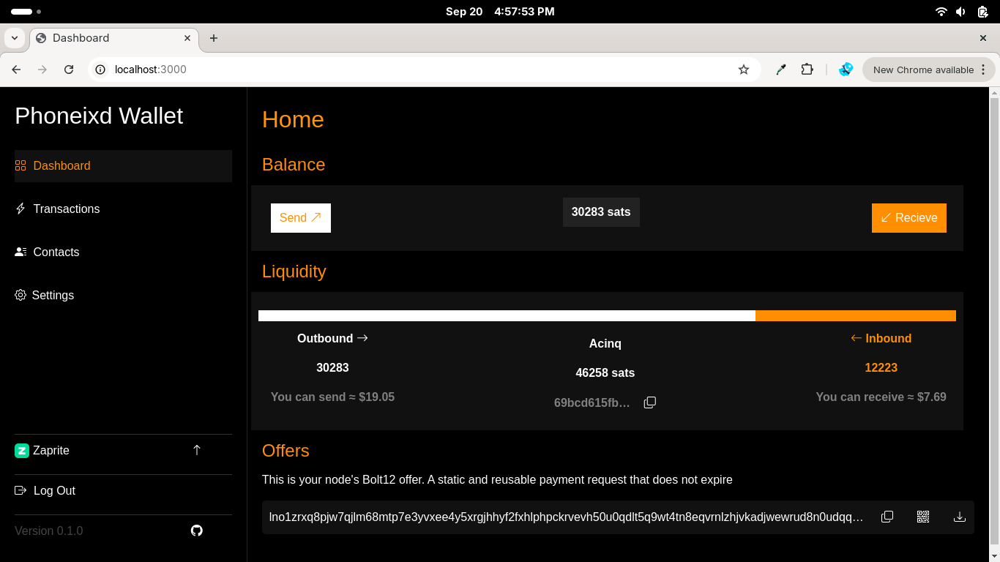
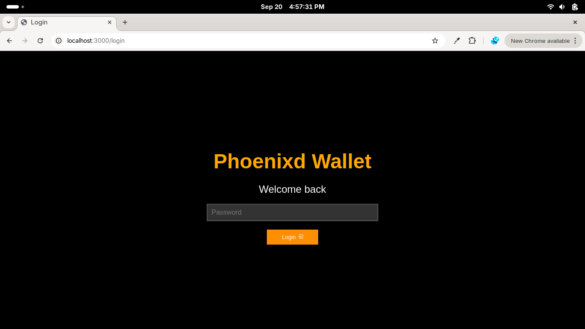
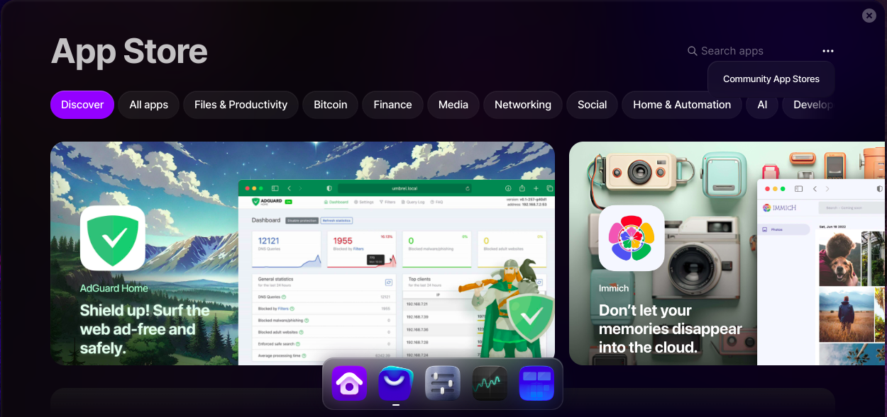
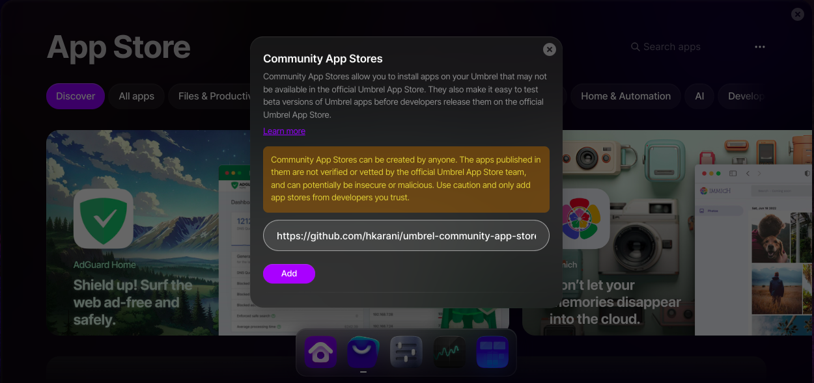
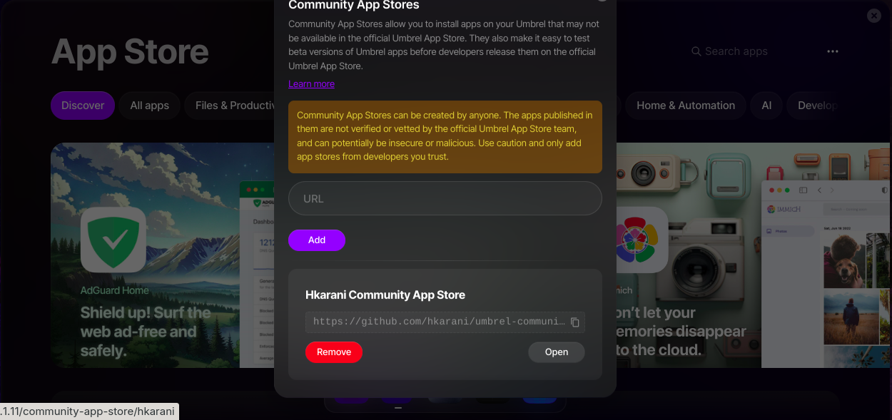
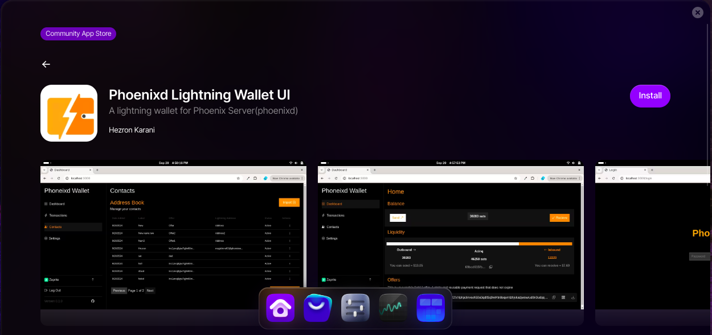

## Phoenixd Lightning Wallet UI Community App Store

# Phoenixd Lightning Wallet UI (Umbrel)

This project is a Lightning wallet interface built on top of [Phoenixd server](https://phoenix.acinq.co/server/) designed for [Umbrel Server](https://umbrel.com/umbrelos). 

It lets you easily manage your phoenixd transactions and leverage the power of Phoenixd for your Bitcoin Lightning wallet needs.

This repository creates the community store that is use to install `phoenixd-lightning-wallet-ui` on [UmbrelOS](https://umbrel.com/umbrelos). Learn more about service packaging in the [Developer Docs](https://start9.com/latest/developer-docs/).

## How to installing on Umbrel

1. Go **Umbrell App Store**  > and click **Community App Store** athe 3-dots

2. Add the [Phoenixd Wallet Community Store link](https://github.com/hkarani/umbrel-community-app-store) 

3.Open the community store and open Phoenixd Lightning Wallet

3. Install app and restart if it takes long to start

